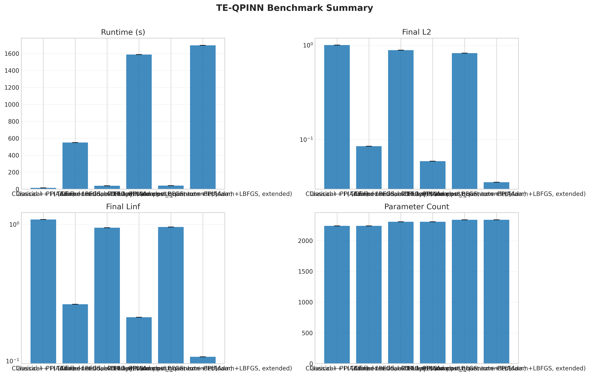
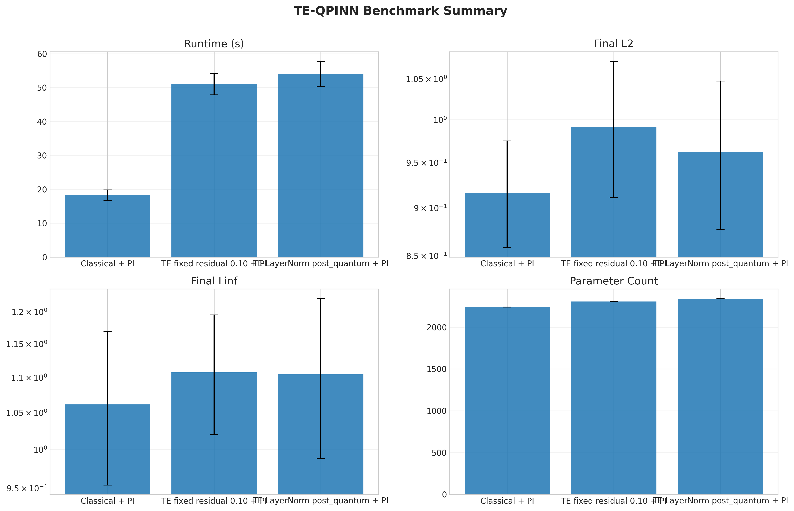
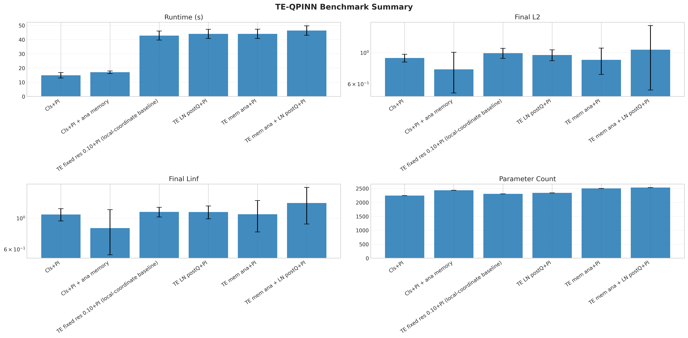
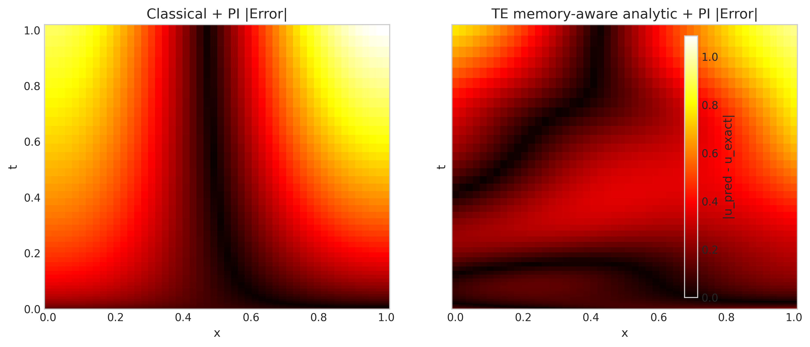

# Quantum-Inspired PINNs for Time-Fractional Integro-Differential Equations

> **Quantum-Readiness Branch**
>
> This branch extends a classical PINN + product-integration solver with a **TE-QPINN-inspired surrogate model**.
> The implemented TE module is **quantum-inspired** (classical PyTorch surrogate), not a hardware quantum circuit.
> The objective is to test whether quantum-style embeddings, entanglement-inspired mixing, and expectation-style readout improve PINN behavior on the same fractional integro-differential equation.

## Main Research Question

Can a TE-QPINN-inspired surrogate improve accuracy, stability, or optimizer sensitivity compared with a classical PINN baseline for a time-fractional integro-differential equation?

## Problem Formulation

We solve:

$$
D_t^\alpha u(x,t) - (x^2 + 1)u_{xx} + \int_0^t \sin(x)(t-s)^{-\beta}u(x,s)\,ds = f(x,t)
$$

- Domain: $x \in [0,1]$, $t \in (0,1]$
- Boundary conditions:
  - $u(0,t) = t^\alpha$
  - $u(1,t) = -t^\alpha$
- Initial condition:
  - $u(x,0) = 0$

## TE-QPINN-Inspired Surrogate Architecture

Implemented components in this branch:

- trainable embedding network
- input rescaling
- angle-style encoding
- sin/cos quantum-inspired feature map
- entanglement-inspired pairwise feature mixing
- expectation-style readout
- residual correction branch
- optional learned gated residual blending
- optional post-quantum/post-entanglement LayerNorm

Scope note:

- This is **not** a full quantum circuit simulator.
- This is **not** hardware-executable quantum computing.
- This is a classical surrogate inspired by TE-QPINN design ideas.

## Classical Baseline (Secondary Reference)

Classical PINN + PI remains the baseline for fair comparison:

- same PDE/problem setup
- same physics-informed residual objective structure
- same boundary/initial conditioning setup
- used to evaluate whether TE-inspired architecture adds value

## Results Snapshot

### A) Adam-Only 5-Seed Comparison (Locked 50x50, Seeds 0..4)

| Variant | Final L2 (mean ± std) | Final Linf (mean ± std) | Final Loss (mean ± std) |
| --- | ---: | ---: | ---: |
| Classical + PI | 0.916583 ± 0.058399 | 1.061336 ± 0.107421 | 43.197057 ± 10.514407 |
| TE fixed residual 0.10 + PI | 0.991693 ± 0.080669 | 1.107482 ± 0.087500 | 48.784985 ± 9.389905 |
| TE LayerNorm post_quantum + PI | 0.962204 ± 0.084977 | 1.104512 ± 0.116844 | 43.598615 ± 8.919407 |

Interpretation:

- Classical remains strongest overall under Adam-only.
- Post-quantum LayerNorm improves TE vs fixed TE in mean L2 and loss.
- TE LayerNorm wins L2 `5/5` against fixed TE, but does not beat Classical overall.

### B) Adam+LBFGS Extended-Budget Seed-42 Comparison

| Variant | Final L2 | Final Linf | Final Loss | Runtime (s) |
| --- | ---: | ---: | ---: | ---: |
| Classical + PI (Adam+LBFGS) | 0.0851 | 0.2604 | 0.1611 | 549.77 |
| TE fixed 0.10 + PI (Adam+LBFGS) | 0.0590 | 0.2091 | 0.0817 | 1589.80 |
| TE LayerNorm post_quantum + PI (Adam+LBFGS) | 0.035359 | 0.107435 | 0.129883 | 1697.67 |

Interpretation:

- Adam+LBFGS is **extended-budget**, not equal-runtime.
- TE LayerNorm achieved the strongest seed-42 accuracy, with high runtime cost.
- This indicates strong optimizer sensitivity and high-accuracy potential on TE variants.

### C) Memory-Aware TE-QPINN Smoke (Seed 42 Only)

| Variant | Params | Runtime (s) | Final Loss | Final L2 | Final Linf |
| --- | ---: | ---: | ---: | ---: | ---: |
| Classical + PI | 2241 | 17.3504 | 62.2103 | 1.00381 | 1.08578 |
| Classical + PI + analytic memory | 2433 | 18.3400 | 62.3695 | 0.92487 | 0.83902 |
| TE fixed residual 0.10 + PI | 2306 | 44.6783 | 71.4435 | 0.88684 | 0.94618 |
| TE LayerNorm post_quantum + PI | 2338 | 47.2960 | 54.0574 | 0.82390 | 0.95765 |
| TE memory-aware analytic + PI | 2498 | 47.3314 | 37.0430 | 0.68147 | 0.95543 |
| TE memory-aware analytic + LayerNorm post_quantum + PI | 2530 | 49.8322 | 45.7305 | 0.69897 | 0.81093 |

Interpretation:

- Memory-aware TE looks promising on seed 42 (notably L2 and loss).
- Classical + memory-feature control also improves strongly, so gains may partly come from feature engineering.
- This is **smoke-only** evidence; no general claim is made until multi-seed validation is run.

### D) Memory-Aware TE-QPINN Locked 5-Seed Validation (Seeds 0..4)

| Variant | Final L2 (mean ± std) | Final Linf (mean ± std) | Final Loss (mean ± std) | Runtime (s, mean ± std) | Params |
| --- | ---: | ---: | ---: | ---: | ---: |
| Classical + PI | 0.916583 ± 0.058399 | 1.061336 ± 0.107421 | 43.197057 ± 10.514407 | 14.8572 ± 1.8966 | 2241 |
| Classical + PI + analytic memory | 0.761948 ± 0.244735 | 0.848289 ± 0.300985 | 37.475642 ± 16.982665 | 17.0129 ± 0.9201 | 2433 |
| TE LayerNorm post_quantum + PI (best non-memory TE) | 0.962204 ± 0.084977 | 1.104512 ± 0.116844 | 43.598615 ± 8.919407 | 44.0333 ± 3.2133 | 2338 |
| TE memory-aware analytic + PI | 0.889161 ± 0.187862 | 1.065903 ± 0.269021 | 35.705541 ± 8.592595 | 44.0522 ± 3.2268 | 2498 |

Interpretation:

- Memory-aware TE improves over best non-memory TE on mean L2 and mean loss.
- Classical + memory control is still stronger on mean L2/Linf, so TE-specific memory advantage is not yet proven.
- This supports continuing memory-aware work, but with strict fairness controls and confirmatory multi-seed follow-up.

## Key Figures

Curated plots are collected in: `outputs/plots/key_results/`






## Experiment Timeline (Completed Phases)

- [x] TE-QPINN surrogate implemented
- [x] model factory support added
- [x] unit tests added
- [x] config-driven benchmark runner added
- [x] smoke benchmark completed
- [x] 50x50 single-seed benchmark completed
- [x] 5-seed validation completed
- [x] ablation study completed
- [x] residual-scale validation completed
- [x] learned gated residual tested
- [x] post-quantum LayerNorm tested
- [x] optimizer sensitivity study completed
- [x] memory-aware analytic smoke completed
- [x] memory-aware analytic 5-seed validation completed

## How To Run

Run tests:

```bash
pytest -q
```

Smoke benchmark:

```bash
python scripts/benchmark_te_qpinn.py --benchmark-config configs/benchmark_te_qpinn_smoke.yaml
```

5-seed benchmark:

```bash
python scripts/benchmark_te_qpinn.py --benchmark-config configs/benchmark_te_qpinn_multiseed.yaml
```

LayerNorm multi-seed:

```bash
python scripts/benchmark_te_qpinn.py --benchmark-config configs/benchmark_te_qpinn_layernorm_multiseed.yaml
```

Optimizer sensitivity:

```bash
python scripts/benchmark_te_qpinn.py --benchmark-config configs/benchmark_te_qpinn_optimizer_sensitivity.yaml --resume-incomplete
```

Memory-aware smoke (Phase 8C):

```bash
python scripts/benchmark_te_qpinn.py --benchmark-config configs/benchmark_te_qpinn_memory_smoke.yaml
```

Memory-aware multi-seed (Phase 8D):

```bash
python scripts/benchmark_te_qpinn.py --benchmark-config configs/benchmark_te_qpinn_memory_multiseed.yaml --resume-incomplete
```

## Output / Artifact Index

- `outputs/benchmarks/te_qpinn_multiseed/`
- `outputs/benchmarks/te_qpinn_layernorm_multiseed/`
- `outputs/benchmarks/te_qpinn_optimizer_sensitivity/`
- `outputs/benchmarks/te_qpinn_memory_smoke/`
- `outputs/benchmarks/te_qpinn_memory_multiseed/`
- `outputs/plots/te_qpinn_multiseed/`
- `outputs/plots/te_qpinn_layernorm_multiseed/`
- `outputs/plots/te_qpinn_optimizer_sensitivity/`
- `outputs/plots/te_qpinn_memory_smoke/`
- `outputs/plots/te_qpinn_memory_multiseed/`
- `outputs/plots/key_results/`
- `docs/te_qpinn_benchmark_analysis.md`
- `docs/te_qpinn_memory_aware_plan.md`

## Current Interpretation

- Classical PINN + PI is still more efficient and stronger under Adam-only averages.
- TE fixed baseline is not sufficient by itself.
- LayerNorm improves TE-side stability and mean TE performance vs fixed TE.
- LBFGS significantly improves accuracy for all variants, especially TE LayerNorm.
- Runtime cost is a major limitation for LBFGS-based high-accuracy runs.
- Memory-aware TE improves over non-memory TE on mean L2/loss in 5-seed testing, but still trails Classical + memory control on mean L2/Linf.
- Current evidence supports memory feature usefulness; a distinct TE-architecture advantage is not yet confirmed.

## Next Steps

- Stage A: 10-seed Adam-only stability map
- Stage B: targeted Adam+LBFGS runs on finalists
- Stage C: equal-runtime and equal-epoch finalist study
- statistical testing (paired tests + effect sizes)
- bootstrap confidence intervals
- time-to-quality curves
- alpha/beta robustness tests
- hard boundary/initial-condition output transforms

---

For full quantitative detail, phase-by-phase interpretation, and caveats, see:
- `docs/te_qpinn_benchmark_analysis.md`
- `docs/te_qpinn_memory_aware_plan.md`
- `outputs/plots/key_results/README.md`
